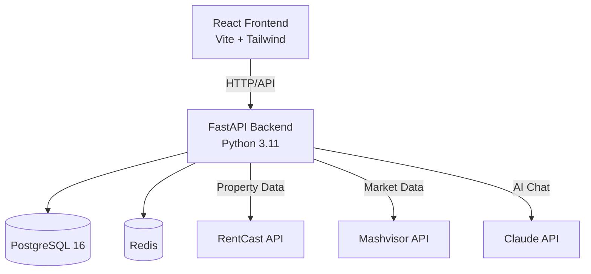

# MidwestDealAnalyzer

Full-stack real estate investment analyzer for Wisconsin rental markets.

## Screenshot

_Coming soon after Phase 1 deployment_

## Live Demo

_Coming soon after Phase 1 deployment_

## Quick Start

```bash
# Clone the repository
git clone https://github.com/yourusername/midwestdealanalyzer.git
cd midwestdealanalyzer

# Start services with Docker Compose
docker-compose up -d

# Open the application
open http://localhost:3000
```

## Architecture



## What I Built vs. What Claude Code Built

**I built:**
- Deal calculation engine (`backend/app/services/deal_calculator.py`) — All financial formulas (NOI, cap rate, cash-on-cash, DSCR, GRM, IRR) are hand-written with Decimal precision
- 11-factor risk scoring algorithm (`backend/app/services/risk_engine.py`) — Factor selection, weights, and scoring thresholds are my design decisions
- LLM prompt engineering (`backend/app/services/chatbot.py`) — System prompt structure, deal serialization format, and context injection strategy
- Financial utilities (`backend/app/utils/financial.py`) — Mortgage amortization, IRR calculation, equity buildup projections

**Claude Code built:**
- Database models, Pydantic schemas, and API routers (scaffolding)
- Frontend React components and routing structure
- CI/CD pipelines, Docker configuration, and infrastructure setup
- Test fixtures and database setup utilities

I chose the risk scoring weights, I designed the API contracts, and I can walk through every financial formula on a whiteboard.

## Tech Stack


## Documentation

This project is fully documented across three key documents:

- **[CLAUDE.md](CLAUDE.md)** — Project briefing for AI-assisted development. Contains code conventions, ownership boundaries, testing requirements, and development workflow.
- **[ARCHITECTURE.md](ARCHITECTURE.md)** — Complete system architecture, database schema, API endpoint design, and technical decisions.
- **[PRD.md](PRD.md)** — Product Requirements Document with user journeys, screen specifications, design system, feature priorities by phase, and success metrics.

**Open Questions:** See [OPEN_QUESTIONS.md](OPEN_QUESTIONS.md) for tracking decisions that need to be made during development.

## Deployment (Railway)

The FastAPI backend is deployed to Railway. The backend Dockerfile expects the **repository root** as the Docker build context. See **[docs/railway-setup.md](docs/railway-setup.md)** for exact Railway dashboard settings (Root Directory = repo root, Dockerfile path = `backend/Dockerfile`) and optional config-as-code (`railway.toml`). After changing those settings, trigger a new deploy so the build succeeds.

## Architecture Decision Records

**PostgreSQL over MongoDB:** Real estate data is inherently relational. A property has many deals, a user has many properties, deals have financial projections tied to market data snapshots. PostgreSQL handles this naturally and is the industry standard for financial data.

**FastAPI over Django:** FastAPI gives async support out of the box, which matters when making multiple external API calls (RentCast, Mashvisor) per request. It also auto-generates OpenAPI docs at `/docs`. Django's ORM is powerful but overkill here — SQLAlchemy with FastAPI gives more control and is more common in backend engineering roles.

**Direct Context Injection over RAG:** At the scale of a personal portfolio tool (5-50 properties), all deal data fits comfortably in a single LLM context window (~2,000-5,000 tokens). RAG adds complexity (embedding pipeline, vector indexing, similarity search tuning) and provides zero benefit at this scale. Serialize all user deals into the system prompt and let the LLM reason over the full dataset directly. If the app scales to thousands of properties per user, RAG becomes necessary — documented as a "future scalability path" but not built now.
